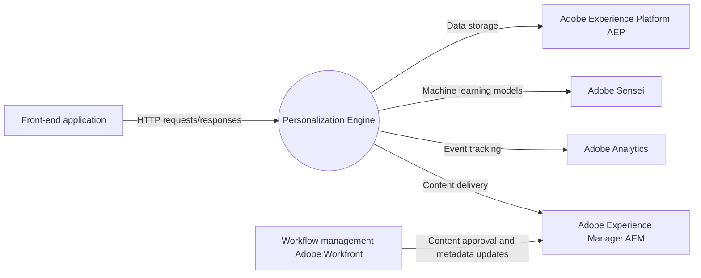
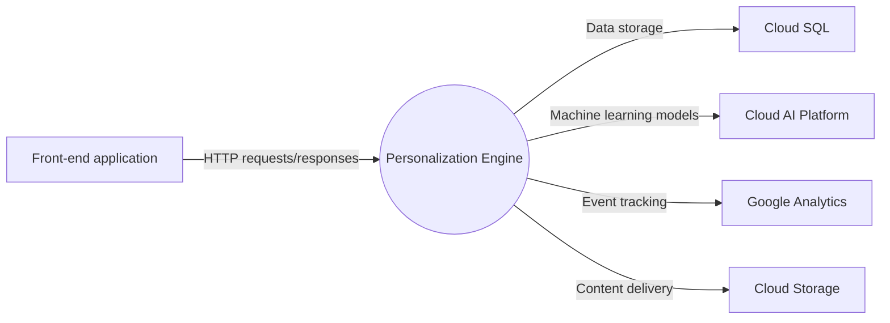
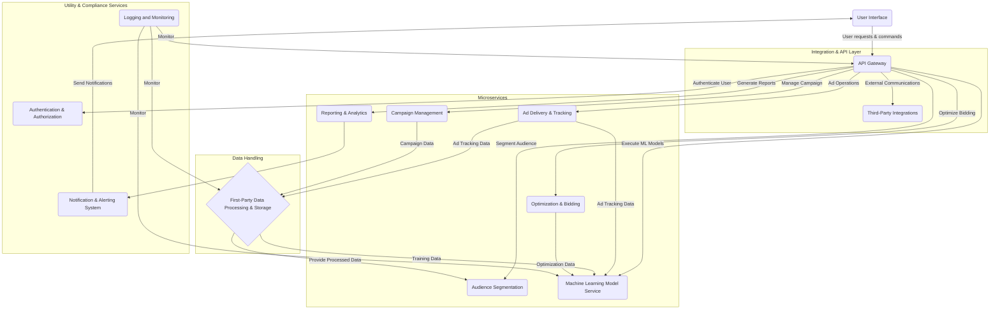

## Personalization Engine Architecture

```mermaid

graph LR

A[Front-end application] -- HTTP requests/responses --> B((Personalization Engine))
B -- Data storage --> C[Adobe Experience Platform AEP]
B -- Machine learning models --> D[Adobe Sensei]
B -- Event tracking --> E[Adobe Analytics]
B -- Content delivery --> F[Adobe Experience Manager AEM]
G[Workflow management Adobe Workfront] -- Content approval and metadata updates --> F

```

## Personalization Engine Architecture

```mermaid

graph LR

A[Front-end application] -- HTTP requests/responses --> B((Personalization Engine))
B -- Data storage --> C[Cloud SQL]
B -- Machine learning models --> D[Cloud AI Platform]
B -- Event tracking --> E[Google Analytics]
B -- Content delivery --> F[Cloud Storage]
```

## RMN

```mermaid
graph TD

  UI(User Interface)
  APIG(API Gateway)
  Auth(Authentication & Authorization)
  CM(Campaign Management)
  OB(Optimization & Bidding)
  ADT(Ad Delivery & Tracking)
  Data{First-Party Data Processing & Storage}
  AS(Audience Segmentation)
  RA(Reporting & Analytics)
  ML(Machine Learning Model Service)
  TPI(Third-Party Integrations)
  NAS(Notification & Alerting System)
  LM(Logging and Monitoring)
  
  UI -->|User requests & commands| APIG
  APIG -->|Authenticate User| Auth
  APIG -->|Manage Campaign| CM
  APIG -->|Ad Operations| ADT
  APIG -->|Optimize Bidding| OB
  APIG -->|Segment Audience| AS
  APIG -->|Generate Reports| RA
  APIG -->|Execute ML Models| ML
  APIG -->|External Communications| TPI
  
  ADT -->|Ad Tracking Data| Data
  ADT -->|Ad Tracking Data| ML
  CM -->|Campaign Data| Data
  Data -->|Provide Processed Data| AS
  Data -->|Training Data| ML
  OB -->|Optimization Data| ML
  RA --> NAS -->|Send Notifications| UI
  LM -->|Monitor| APIG
  LM -->|Monitor| Data
  LM -->|Monitor| ML
  
  subgraph "Microservices" 
    CM
    OB
    ADT
    AS
    RA
    ML
  end

  subgraph "Utility & Compliance Services"
    Auth
    NAS
    LM
  end
  
  subgraph "Data Handling"
    Data
  end
  
  subgraph "Integration & API Layer"
    APIG
    TPI
  end
```

